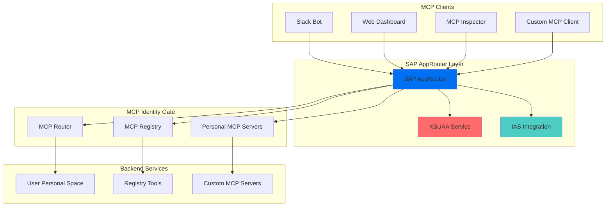
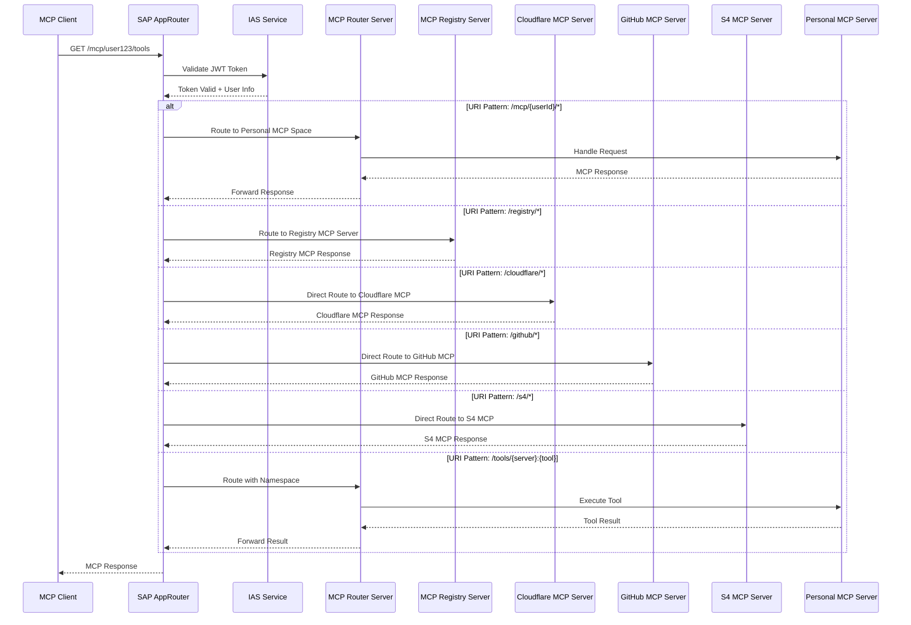
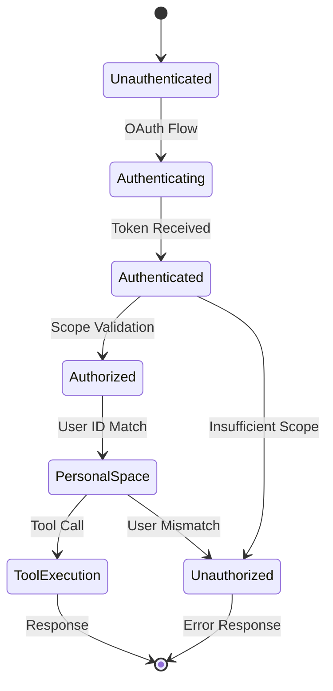

# SAP AppRouter & IAS Integration: Conceptual Exploration for MCP Identity Gate

## Overview

This document explores the conceptual integration of SAP AppRouter and Identity Authentication Service (IAS) with the MCP Identity Gate system. It examines how enterprise-grade routing, authentication, and URI pattern matching could enhance the personal MCP server concept.

## Architecture Diagrams

### 1. High-Level AppRouter Architecture



### 2. MCP URI Pattern Routing Flow



### 3. Authentication and Authorization Flow



## MCP URI Patterns and Routing: Conceptual Approach

### 1. Downstream MCP Server Architecture

The AppRouter routes to different specialized MCP servers based on the request pattern:

- **MCP Router Server** (`mcp-router-server`): Handles personal MCP spaces, tool execution, and OAuth flows
- **MCP Registry Server** (`mcp-registry-server`): Manages server metadata, discovery, and aggregation
- **MCP Dashboard Server** (`mcp-dashboard-server`): Provides web interface for managing MCP servers
- **MCP Inspector Server** (`mcp-inspector-server`): Development and debugging tools for MCP servers

#### External MCP Server Destinations

The AppRouter can also route directly to external MCP servers or through the router:

- **Cloudflare MCP Server**: Direct access to Cloudflare APIs and services
- **GitHub MCP Server**: Direct access to GitHub repositories and workflows
- **S4 MCP Server**: Direct access to SAP S/4HANA systems and data
- **Custom MCP Servers**: Any external MCP server with proper authentication

### 2. URI Pattern Structure Exploration

The `NamespacedDataStore` implementation suggests interesting patterns for MCP URIs:

```
{server}:{resource}
{server}:{resource}:{subresource}
{server}:{tool}:{action}
{server}:{prompt}:{name}
{server}:{resourceTemplate}:{pattern}
```

This namespace approach could be extended to support enterprise routing patterns.

### 3. Routing Strategies

#### Direct Routing to External MCP Servers
- **Cloudflare**: `/cloudflare/*` → Direct to Cloudflare MCP Server
- **GitHub**: `/github/*` → Direct to GitHub MCP Server  
- **S4**: `/s4/*` → Direct to S4 MCP Server
- **Custom**: `/custom/*` → Direct to Custom MCP Server

#### Router-Mediated Routing
- **Personal Spaces**: `/mcp/{userId}/*` → Through MCP Router Server
- **Tool Execution**: `/tools/{server}:{tool}` → Through MCP Router Server
- **Resource Access**: `/resources/{server}:{resource}` → Through MCP Router Server

#### Registry-Mediated Routing
- **Server Discovery**: `/registry/*` → Through MCP Registry Server
- **Metadata Access**: `/templates/*` → Through MCP Registry Server

### 4. Namespace Patterns

```typescript
// Tool patterns
"@registry:list"           // Registry tools
"@registry:connect"        // Connect to server
"@registry:disconnect"     // Disconnect from server
"@auth:{server}"          // Authentication tools
"@sap:user-info"          // SAP-specific tools
"@sap:validate-token"     // Token validation

// Resource patterns
"@registry:servers"        // Server list
"@registry:tools"          // Tool list
"@registry:prompts"        // Prompt list
"@registry:resources"      // Resource list

// Personal space patterns
"{userId}:tools"           // User's tools
"{userId}:resources"       // User's resources
"{userId}:prompts"         // User's prompts
```

## AppRouter Configuration: Conceptual Design

### 1. Main AppRouter Configuration Concept (`xs-app.json`)

```json
{
  "welcomeFile": "/",
  "authenticationMethod": "route",
  "sessionTimeout": 30,
  "routes": [
    {
      "source": "^/mcp/([^/]+)(/.*)?$",
      "target": "/mcp/$1$2",
      "destination": "mcp-router-server",
      "authenticationType": "ias",
      "scope": ["openid", "profile", "email", "mcp:tools"],
      "csrfProtection": false,
      "headers": {
        "X-MCP-User": "$USER",
        "X-MCP-Tenant": "$TENANT"
      }
    },
    {
      "source": "^/registry/(.*)$",
      "target": "/registry/$1",
      "destination": "mcp-registry-server",
      "authenticationType": "ias",
      "scope": ["openid", "profile", "email", "mcp:registry"],
      "csrfProtection": false
    },
    {
      "source": "^/dashboard/(.*)$",
      "target": "/dashboard/$1",
      "destination": "mcp-dashboard-server",
      "authenticationType": "ias",
      "scope": ["openid", "profile", "email", "mcp:dashboard"],
      "csrfProtection": false
    },
    {
      "source": "^/oauth/(.*)$",
      "target": "/oauth/$1",
      "destination": "mcp-router-server",
      "authenticationType": "ias",
      "scope": ["openid", "profile", "email", "mcp:tools"],
      "csrfProtection": false
    },
    {
      "source": "^/tools/([^/]+):([^/]+)(/.*)?$",
      "target": "/tools/$1/$2$3",
      "destination": "mcp-router-server",
      "authenticationType": "ias",
      "scope": ["openid", "profile", "email", "mcp:tools"],
      "csrfProtection": false
    },
    {
      "source": "^/resources/([^/]+):([^/]+)(/.*)?$",
      "target": "/resources/$1/$2$3",
      "destination": "mcp-router-server",
      "authenticationType": "ias",
      "scope": ["openid", "profile", "email", "mcp:tools"],
      "csrfProtection": false
    },
    {
      "source": "^/prompts/([^/]+):([^/]+)(/.*)?$",
      "target": "/prompts/$1/$2$3",
      "destination": "mcp-router-server",
      "authenticationType": "ias",
      "scope": ["openid", "profile", "email", "mcp:tools"],
      "csrfProtection": false
    },
    {
      "source": "^/health$",
      "target": "/health",
      "destination": "mcp-gateway",
      "authenticationType": "none"
    },
    {
      "source": "^/metrics$",
      "target": "/metrics",
      "destination": "mcp-router-server",
      "authenticationType": "ias",
      "scope": ["openid", "profile", "email", "mcp:admin"],
      "csrfProtection": false
    },
    {
      "source": "^/inspector/(.*)$",
      "target": "/inspector/$1",
      "destination": "mcp-inspector-server",
      "authenticationType": "ias",
      "scope": ["openid", "profile", "email", "mcp:tools"],
      "csrfProtection": false
    },
    {
      "source": "^/cloudflare/(.*)$",
      "target": "/cloudflare/$1",
      "destination": "cloudflare-mcp-server",
      "authenticationType": "ias",
      "scope": ["openid", "profile", "email", "mcp:cloudflare"],
      "csrfProtection": false
    },
    {
      "source": "^/github/(.*)$",
      "target": "/github/$1",
      "destination": "github-mcp-server",
      "authenticationType": "ias",
      "scope": ["openid", "profile", "email", "mcp:github"],
      "csrfProtection": false
    },
    {
      "source": "^/s4/(.*)$",
      "target": "/s4/$1",
      "destination": "s4-mcp-server",
      "authenticationType": "ias",
      "scope": ["openid", "profile", "email", "mcp:s4"],
      "csrfProtection": false
    },
    {
      "source": "^/custom/(.*)$",
      "target": "/custom/$1",
      "destination": "custom-mcp-server",
      "authenticationType": "ias",
      "scope": ["openid", "profile", "email", "mcp:custom"],
      "csrfProtection": false
    }
  ],
  "destinations": {
    "mcp-router-server": {
      "url": "https://mcp-router.cfapps.eu12.hana.ondemand.com",
      "forwardAuthToken": true,
      "timeout": 30000,
      "description": "MCP Router Server - Handles personal MCP spaces and tool execution"
    },
    "mcp-registry-server": {
      "url": "https://mcp-registry.cfapps.eu12.hana.ondemand.com",
      "forwardAuthToken": true,
      "timeout": 30000,
      "description": "MCP Registry Server - Manages server metadata and discovery"
    },
    "mcp-dashboard-server": {
      "url": "https://mcp-dashboard.cfapps.eu12.hana.ondemand.com",
      "forwardAuthToken": true,
      "timeout": 30000,
      "description": "MCP Dashboard Server - Web interface for managing MCP servers"
    },
    "mcp-inspector-server": {
      "url": "https://mcp-inspector.cfapps.eu12.hana.ondemand.com",
      "forwardAuthToken": true,
      "timeout": 30000,
      "description": "MCP Inspector Server - Development and debugging tools"
    },
    "cloudflare-mcp-server": {
      "url": "https://api.cloudflare.com/mcp",
      "forwardAuthToken": true,
      "timeout": 30000,
      "description": "Cloudflare MCP Server - Direct access to Cloudflare APIs"
    },
    "github-mcp-server": {
      "url": "https://api.github.com/mcp",
      "forwardAuthToken": true,
      "timeout": 30000,
      "description": "GitHub MCP Server - Direct access to GitHub repositories and workflows"
    },
    "s4-mcp-server": {
      "url": "https://your-s4-system.com/mcp",
      "forwardAuthToken": true,
      "timeout": 30000,
      "description": "S4 MCP Server - Direct access to SAP S/4HANA systems"
    },
    "custom-mcp-server": {
      "url": "https://your-custom-mcp-server.com/mcp",
      "forwardAuthToken": true,
      "timeout": 30000,
      "description": "Custom MCP Server - External MCP server with custom functionality"
    }
  },
  "login": {
    "callbackEndpoint": "/login/callback"
  },
  "logout": {
    "logoutEndpoint": "/logout",
    "logoutPage": "/logout.html"
  }
}
```

### 2. Advanced Routing Pattern Concepts

#### 2.1 MCP Tool Execution Route Ideas

```json
{
  "source": "^/execute/([^/]+):([^/]+)$",
  "target": "/execute/$1/$2",
  "destination": "mcp-router-server",
  "authenticationType": "ias",
  "scope": ["openid", "profile", "email", "mcp:tools"],
  "csrfProtection": false,
  "headers": {
    "X-MCP-Tool-Server": "$1",
    "X-MCP-Tool-Name": "$2"
  }
}
```

#### 2.2 Resource Template Route Concepts

```json
{
  "source": "^/templates/([^/]+):([^/]+)(/.*)?$",
  "target": "/templates/$1/$2$3",
  "destination": "mcp-registry-server",
  "authenticationType": "ias",
  "scope": ["openid", "profile", "email", "mcp:registry"],
  "csrfProtection": false
}
```

#### 2.3 Authentication Flow Route Ideas

```json
{
  "source": "^/auth/([^/]+)/callback$",
  "target": "/auth/$1/callback",
  "destination": "mcp-router-server",
  "authenticationType": "ias",
  "scope": ["openid", "profile", "email", "mcp:tools"],
  "csrfProtection": false
}
```

### 3. Environment-Specific Configuration Concepts

#### 3.1 Development Configuration Ideas (`xs-app-dev.json`)

```json
{
  "welcomeFile": "/",
  "authenticationMethod": "route",
  "routes": [
    {
      "source": "^/mcp/([^/]+)(/.*)?$",
      "target": "/mcp/$1$2",
      "destination": "mcp-router-server-dev",
      "authenticationType": "ias",
      "scope": ["openid", "profile", "email", "mcp:tools"],
      "csrfProtection": false
    }
  ],
  "destinations": {
    "mcp-gateway-dev": {
      "url": "http://localhost:8081",
      "forwardAuthToken": true
    }
  }
}
```

#### 3.2 Production Configuration Concepts (`xs-app-prod.json`)

```json
{
  "welcomeFile": "/",
  "authenticationMethod": "route",
  "sessionTimeout": 30,
  "routes": [
    {
      "source": "^/mcp/([^/]+)(/.*)?$",
      "target": "/mcp/$1$2",
      "destination": "mcp-gateway-prod",
      "authenticationType": "ias",
      "scope": ["openid", "profile", "email", "mcp:tools"],
      "csrfProtection": false,
      "headers": {
        "X-MCP-User": "$USER",
        "X-MCP-Tenant": "$TENANT",
        "X-Forwarded-For": "$CLIENT_IP"
      }
    }
  ],
  "destinations": {
    "mcp-gateway-prod": {
      "url": "https://mcp-gateway.cfapps.eu12.hana.ondemand.com",
      "forwardAuthToken": true,
      "timeout": 30000,
      "headers": {
        "X-AppRouter-Version": "1.0.0"
      }
    }
  }
}
```

## MCP URI Pattern Examples: Conceptual Patterns

### 1. Tool Execution Pattern Ideas

```typescript
// Registry tools
"@registry:list"                    // List all servers
"@registry:connect"                 // Connect to server
"@registry:disconnect"              // Disconnect from server
"@registry:info"                    // Get server info

// Authentication tools
"@auth:github"                      // GitHub authentication
"@auth:google-drive"                // Google Drive authentication
"@auth:custom-server"               // Custom server authentication

// SAP-specific tools
"@sap:user-info"                    // Get user information
"@sap:validate-token"               // Validate IAS token
"@sap:list-users"                   // List IAS users
"@sap:manage-groups"                // Manage IAS groups

// Personal server tools
"user123:my-tool"                   // User's custom tool
"user123:database-query"            // User's database tool
"user123:file-manager"              // User's file management tool

// External MCP server tools
"cloudflare:list-zones"             // Cloudflare zone management
"cloudflare:update-dns"             // Cloudflare DNS management
"github:list-repos"                 // GitHub repository listing
"github:create-issue"               // GitHub issue creation
"s4:read-customer"                  // S4 customer data access
"s4:update-sales-order"             // S4 sales order management
"custom:api-call"                   // Custom API integration
```

### 2. Resource Access Pattern Concepts

```typescript
// Registry resources
"@registry:servers"                 // Server list resource
"@registry:tools"                   // Tool list resource
"@registry:prompts"                 // Prompt list resource
"@registry:resources"               // Resource list

// Personal resources
"user123:files"                     // User's files
"user123:databases"                 // User's databases
"user123:config"                    // User's configuration

// External MCP server resources
"cloudflare:zones"                  // Cloudflare zones
"cloudflare:dns-records"            // Cloudflare DNS records
"github:repositories"               // GitHub repositories
"github:issues"                     // GitHub issues
"s4:customers"                      // S4 customer data
"s4:sales-orders"                   // S4 sales orders
"custom:api-data"                   // Custom API data

// Resource templates
"@registry:file-template"           // File resource template
"@registry:database-template"       // Database resource template
"user123:custom-template"           // User's custom template
```

### 3. Prompt Access Pattern Ideas

```typescript
// Registry prompts
"@registry:help"                    // Help prompt
"@registry:setup"                   // Setup prompt
"@registry:error-handling"          // Error handling prompt

// Personal prompts
"user123:welcome"                   // User's welcome prompt
"user123:custom-help"               // User's custom help
"user123:workflow"                  // User's workflow prompt
```

## Regex Pattern Matching: Conceptual Approach

### 1. URI Pattern Regex Ideas

```typescript
// Match MCP server patterns
const mcpServerPattern = /^\/mcp\/([^\/]+)(\/.*)?$/;
// Matches: /mcp/user123, /mcp/user123/tools, /mcp/user123/resources

// Match tool execution patterns
const toolPattern = /^\/tools\/([^:]+):([^\/]+)(\/.*)?$/;
// Matches: /tools/@registry:list, /tools/user123:my-tool

// Match resource access patterns
const resourcePattern = /^\/resources\/([^:]+):([^\/]+)(\/.*)?$/;
// Matches: /resources/@registry:servers, /resources/user123:files

// Match authentication patterns
const authPattern = /^\/auth\/([^\/]+)\/callback$/;
// Matches: /auth/github/callback, /auth/google-drive/callback
```

### 2. AppRouter Route Pattern Concepts

```json
{
  "routes": [
    {
      "source": "^/mcp/([^/]+)(/.*)?$",
      "target": "/mcp/$1$2",
      "destination": "mcp-gateway",
      "authenticationType": "ias",
      "scope": ["openid", "profile", "email", "mcp:tools"],
      "csrfProtection": false
    },
    {
      "source": "^/tools/([^:]+):([^/]+)(/.*)?$",
      "target": "/tools/$1/$2$3",
      "destination": "mcp-gateway",
      "authenticationType": "ias",
      "scope": ["openid", "profile", "email", "mcp:tools"],
      "csrfProtection": false
    },
    {
      "source": "^/resources/([^:]+):([^/]+)(/.*)?$",
      "target": "/resources/$1/$2$3",
      "destination": "mcp-gateway",
      "authenticationType": "ias",
      "scope": ["openid", "profile", "email", "mcp:tools"],
      "csrfProtection": false
    },
    {
      "source": "^/prompts/([^:]+):([^/]+)(/.*)?$",
      "target": "/prompts/$1/$2$3",
      "destination": "mcp-gateway",
      "authenticationType": "ias",
      "scope": ["openid", "profile", "email", "mcp:tools"],
      "csrfProtection": false
    },
    {
      "source": "^/auth/([^/]+)/callback$",
      "target": "/auth/$1/callback",
      "destination": "mcp-gateway",
      "authenticationType": "ias",
      "scope": ["openid", "profile", "email", "mcp:tools"],
      "csrfProtection": false
    }
  ]
}
```

## Deployment Configuration: Conceptual Approach

### 1. AppRouter Manifest Ideas (`manifest-approuter.yaml`)

```yaml
applications:
  - name: mcp-approuter
    memory: 256M
    buildpacks:
      - https://github.com/cloudfoundry/nodejs-buildpack
    env:
      TENANT_HOST_PATTERN: "mcp-{tenant}.cfapps.eu12.hana.ondemand.com"
      destinations: >
        [
          {
            "name": "mcp-gateway",
            "url": "https://mcp-gateway.cfapps.eu12.hana.ondemand.com",
            "forwardAuthToken": true,
            "timeout": 30000
          },
          {
            "name": "mcp-dashboard",
            "url": "https://mcp-dashboard.cfapps.eu12.hana.ondemand.com",
            "forwardAuthToken": true,
            "timeout": 30000
          },
          {
            "name": "mcp-registry",
            "url": "https://mcp-registry.cfapps.eu12.hana.ondemand.com",
            "forwardAuthToken": true,
            "timeout": 30000
          }
        ]
      NODE_ENV: production
      LOG_LEVEL: info
    services:
      - mcp-xsuaa
      - mcp-ias
    routes:
      - route: mcp-gateway.cfapps.eu12.hana.ondemand.com
    health-check-type: http
    health-check-http-endpoint: /health
```

### 2. Docker Configuration Concepts (`Dockerfile-approuter`)

```dockerfile
FROM node:18-alpine

# Install AppRouter
RUN npm install -g @sap/approuter

# Create app directory
WORKDIR /app

# Copy configuration files
COPY xs-app.json /app/
COPY package.json /app/

# Install dependencies
RUN npm install

# Expose port
EXPOSE 8080

# Start AppRouter
CMD ["approuter"]
```

### 3. Environment Variable Concepts

```bash
# AppRouter Configuration
TENANT_HOST_PATTERN=mcp-{tenant}.cfapps.eu12.hana.ondemand.com
NODE_ENV=production
LOG_LEVEL=info

# IAS Configuration (Primary Authentication)
IAS_CLIENT_ID=${IAS_CLIENT_ID}
IAS_CLIENT_SECRET=${IAS_CLIENT_SECRET}
IAS_ISSUER=${IAS_ISSUER}
IAS_TENANT=${IAS_TENANT}

# XSUAA Configuration (Fallback/Additional)
XSAPPNAME=mcp-gateway
XSUAA_CLIENT_ID=${XSUAA_CLIENT_ID}
XSUAA_CLIENT_SECRET=${XSUAA_CLIENT_SECRET}
XSUAA_URL=${XSUAA_URL}

# MCP Gateway URLs
MCP_GATEWAY_URL=https://mcp-gateway.cfapps.eu12.hana.ondemand.com
MCP_DASHBOARD_URL=https://mcp-dashboard.cfapps.eu12.hana.ondemand.com
MCP_REGISTRY_URL=https://mcp-registry.cfapps.eu12.hana.ondemand.com
```

## Testing and Validation: Conceptual Approaches

### 1. URI Pattern Testing Ideas

```typescript
// Test MCP URI patterns
const testPatterns = [
  "/mcp/user123",
  "/mcp/user123/tools",
  "/mcp/user123/resources",
  "/tools/@registry:list",
  "/tools/user123:my-tool",
  "/resources/@registry:servers",
  "/resources/user123:files",
  "/prompts/@registry:help",
  "/prompts/user123:welcome",
  "/auth/github/callback"
];

testPatterns.forEach(pattern => {
  const matches = pattern.match(/^\/mcp\/([^\/]+)(\/.*)?$/);
  if (matches) {
    console.log(`MCP Server: ${matches[1]}, Path: ${matches[2] || '/'}`);
  }
});
```

### 2. AppRouter Health Check Concepts

```bash
# Health check endpoint
curl -X GET https://mcp-approuter.cfapps.eu12.hana.ondemand.com/health

# Expected response
{
  "status": "healthy",
  "service": "mcp-approuter",
  "timestamp": "2024-01-15T10:30:00Z",
  "uptime": 3600
}
```

### 3. Authentication Test Ideas

```bash
# Test authentication flow
curl -X GET https://mcp-approuter.cfapps.eu12.hana.ondemand.com/mcp/user123/tools \
  -H "Authorization: Bearer ${JWT_TOKEN}" \
  -H "X-MCP-User: user123"

# Expected response (if authenticated)
{
  "tools": [
    {
      "name": "@registry:list",
      "description": "List all connected MCP servers"
    },
    {
      "name": "@auth:github",
      "description": "Authenticate with GitHub"
    }
  ]
}
```

## Security Considerations: Conceptual Approaches

### 1. Token Validation Ideas

```typescript
// Validate JWT tokens in AppRouter with IAS
const validateToken = (token: string) => {
  try {
    const decoded = jwt.verify(token, publicKey, {
      issuer: process.env.IAS_ISSUER,
      audience: process.env.IAS_CLIENT_ID
    });
    return decoded;
  } catch (error) {
    throw new Error('Invalid IAS token');
  }
};
```

### 2. Scope Validation Concepts

```typescript
// Validate user scopes
const validateScope = (requiredScopes: string[], userScopes: string[]) => {
  return requiredScopes.every(scope => userScopes.includes(scope));
};
```

### 3. User Isolation Concepts

```typescript
// Ensure users can only access their personal space
const validateUserAccess = (requestedUser: string, authenticatedUser: string) => {
  return requestedUser === authenticatedUser;
};
```

## Monitoring and Logging: Conceptual Approaches

### 1. AppRouter Metrics Ideas

```typescript
// Custom metrics for MCP requests
const mcpMetrics = {
  totalRequests: 0,
  authenticatedRequests: 0,
  failedRequests: 0,
  averageResponseTime: 0
};

// Log MCP request patterns
app.use((req, res, next) => {
  if (req.path.startsWith('/mcp/')) {
    console.log(`MCP Request: ${req.method} ${req.path}`);
    mcpMetrics.totalRequests++;
  }
  next();
});
```

### 2. URI Pattern Analytics Concepts

```typescript
// Track URI pattern usage
const patternUsage = {
  'mcp-server': 0,
  'tool-execution': 0,
  'resource-access': 0,
  'authentication': 0
};

// Analyze request patterns
const analyzePattern = (path: string) => {
  if (path.match(/^\/mcp\/[^\/]+/)) patternUsage['mcp-server']++;
  if (path.match(/^\/tools\/[^:]+:[^\/]+/)) patternUsage['tool-execution']++;
  if (path.match(/^\/resources\/[^:]+:[^\/]+/)) patternUsage['resource-access']++;
  if (path.match(/^\/auth\/[^\/]+\/callback/)) patternUsage['authentication']++;
};
```

## Conclusion: Exploring the Possibilities

This conceptual exploration examines how SAP AppRouter and IAS integration could enhance the MCP Identity Gate system. The ideas presented here suggest potential approaches for enterprise-grade routing, authentication, and URI pattern matching that could support the personal MCP server concept at scale.

### Key Exploration Areas:

1. **Enterprise Integration**: How SAP services could enhance MCP capabilities
2. **URI Pattern Evolution**: Extending namespace patterns for enterprise use
3. **Authentication Concepts**: Exploring IAS integration possibilities
4. **Routing Innovation**: Conceptual approaches to MCP request routing
5. **Security Exploration**: Ideas for enterprise-grade security in MCP systems

The concepts presented are meant to inspire further exploration and discussion rather than provide definitive implementation guidance.
